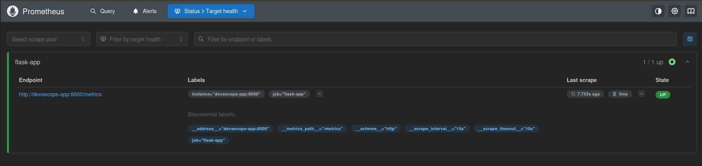
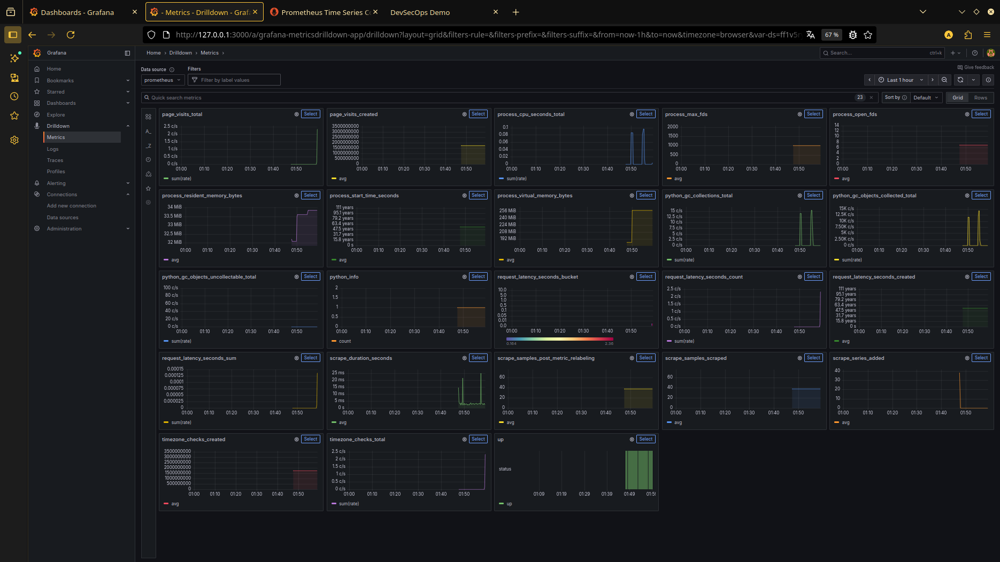

# DevSecOps Pipeline Demo

A Flask application demonstrating a complete DevSecOps pipeline with monitoring capabilities using Prometheus and Grafana.

## Architecture & Technology
- **Application**: Python/Flask Microservice
- **Security Stack**: Semgrep, Trivy, OWASP ZAP, Nikto
- **Monitoring**: Prometheus, Grafana
- **Container**: Docker, Docker Compose
- **CI/CD**: GitHub Actions
- **Testing**: PyTest, Integration Tests

## Features

- Flask web application showing timezone information
- Prometheus metrics integration
- Grafana dashboards for visualization
- Complete DevSecOps pipeline with:
  - SAST (Semgrep)
  - Container scanning (Trivy)
  - DAST (OWASP ZAP, Nikto)
  - Continuous monitoring

## Monitoring Dashboard

### Prometheus Metrics

*Application metrics being scraped by Prometheus*

### Grafana Dashboard

*Real-time monitoring of application metrics*

##  Quick Start

1. Clone the repository:
```bash
git clone git@github.com:aitouakrim10/DevSecOps-Full-Secure-Pipeline.git
cd devsecops
```

2. Start the application stack:
```bash
docker compose up -d
```

3. Access the services:
- Application: `http://localhost:5000`
- Prometheus: `http://localhost:9090`
- Grafana: `http://localhost:3000 (login: admin/admin)`
- Metrics endpoint: `http://localhost:8000/metrics`

## Available Metrics

- `page_visits_total`: Total number of page visits
- `timezone_checks_total`: Number of timezone checks performed
- `request_latency_seconds`: Request latency histogram

## Security Features

The project includes various security checks:
- Static Analysis (Semgrep)
- Container scanning (Trivy)
- Dynamic Analysis (OWASP ZAP, Nikto)
- Dependencies audit

## Project Structure

```
.
├── app
│   ├── app.py
│   └── requirement.txt
│   └── tests
│       ├── __init__.py
│       └── test_app.py
├── Dockerfile
├── docker-compose.yml
├── prometheus
│   └── prometheus.yml
├── images
│   ├── prometheus-status.png
│   └── grafana-dashboard.png
├── .github
│   └── workflows
│       └── pipeline.yml
└── README.md
```

## CI/CD Pipeline

The GitHub Actions pipeline includes:
- Code linting
- Unit tests
- Security scans
- Docker image build
- Container scanning
- DAST testing
- Metrics validation

